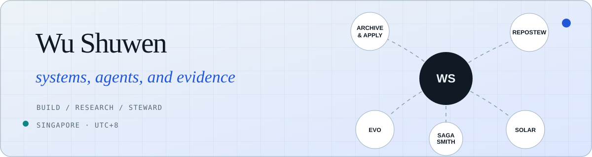

<p align="center">
  <a href="https://dajiaohuang.github.io/">
    
  </a>
</p>

<p align="center">
  <strong>Software Engineer Intern @ TikTok · MSc DSML @ NUS · SJTU alumnus</strong><br>
  I build agent infrastructure, evidence-first workflows, and scientific interfaces.
</p>

<p align="center">
  <a href="https://dajiaohuang.github.io/"><strong>Portfolio</strong></a> ·
  <a href="https://github.com/SagaSmithAI">SagaSmith</a> ·
  <a href="mailto:mikewushuwen@gmail.com">Email</a> ·
  <a href="https://www.linkedin.com/in/wu-shuwen-ab3977259">LinkedIn</a>
</p>

---

### What I am building

| System | The problem it takes seriously |
|---|---|
| [**SagaSmith**](https://github.com/SagaSmithAI) | AI-native TTRPG infrastructure where agents interpret, deterministic engines settle rules, and authoritative MCP services own state. |
| [**RepoStew**](https://github.com/dajiaohuang/RepoStew_skills) | Repository stewardship as a durable loop: verify, audit, fix, test, submit, and maintain through review and CI. |
| [**Archive & Apply**](https://github.com/dajiaohuang/Archive_and_Apply_Skill) | Source-first career and academic workflows that keep every polished claim traceable to evidence. |
| [**Evo Atlas**](https://dajiaohuang.github.io/evo/) | A static-first evidence atlas connecting geological time, fossil occurrences, phylogenetic hypotheses, and scientific uncertainty. |
| [**Solar Atlas**](https://dajiaohuang.github.io/solar/) | Browser-native Solar System dynamics, small-body exploration, event search, and reproducible mission workspaces. |

### How I tend to work

```text
explicit authority  →  reproducible state  →  focused validation  →  maintainable delivery
source evidence     →  bounded inference   →  honest claim        →  useful interface
```

- **Agent systems:** MCP, tool calling, agentic RAG, retrieval, session/state design, safety gates.
- **Scientific interfaces:** React, TypeScript, Three.js, D3, Leaflet, browser workers, static data platforms.
- **Backend & ML:** Python, FastAPI, PyTorch, Transformers, vector retrieval, SQL, Docker/Kubernetes.
- **Stewardship:** repository audits, GitHub workflows, testing, release evidence, documentation and live-site consistency.

### Research roots

- **CVPR 2024** — [Inter-X: Towards Versatile Human-Human Interaction Analysis](https://arxiv.org/abs/2312.16051), co-author.
- **ECCV 2024** — [HIMO: Full-Body Human Interaction with Multiple Objects](https://arxiv.org/abs/2407.12371), co-author.
- **CVPR 2024 Ego-Exo4D Challenge** — third place, Body Pose track, team SJTU-SEIEE.

<p align="center">
  <sub>Singapore · building in public · <a href="https://dajiaohuang.github.io/">see the full system map →</a></sub>
</p>
